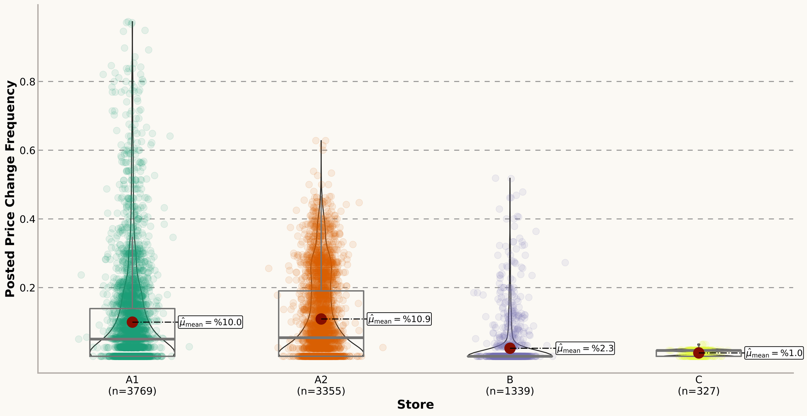
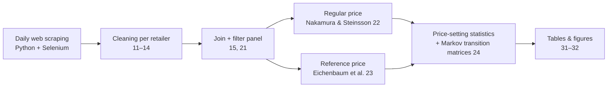

# Nominal Rigidities in Online Prices — Colombia

[](https://doi.org/10.5281/zenodo.22926028)

**How often, how much and in which direction do online prices change, and does the answer depend on the type of business selling them?**

This repository has the data pipeline, estimations and results of my master's thesis. It uses about **820,000 daily prices for 14,425 products**, web-scraped from four large Colombian online stores (anonymized as A1, A2, B and C, as in the paper) between August 2023 and July 2024. With them, I measure price rigidity across three online business models: multichannel supermarkets, a hard-discount store and a price-comparison / delivery platform.

📦 **Dataset:** [Zenodo, DOI 10.5281/zenodo.22926028](https://doi.org/10.5281/zenodo.22926028) · 📄 **Paper:** [English](paper/nominal_rigidities_online_prices_colombia_EN.pdf) · [Español](paper/rigideces_nominales_precios_en_linea_colombia_ES.pdf) · [Defense slides (ES)](paper/slides_thesis_defense_ES.pdf)

---

## Key findings

- **Online prices are flexible, but how flexible depends on the seller.** Implied price durations range from about **3 to 9 weeks**, well below the typical duration in physical stores.
- **Business model matters.** The two multichannel supermarkets change their posted prices on about **5% of days** (median), and their prices last about 4 weeks. The discount store and the delivery platform change prices far less often, with prices lasting about 7–8 weeks.
- **Price changes are large, except at the discount store.** The mean absolute change is **17–24%** at the supermarkets and the platform. At the discount store it is **1.6%** (median 0.28%), about 20 times smaller.
- **Temporary prices revert quickly.** A product at a temporary (sale) price returns to its reference price the next day with probability **≈ 0.75**. Once at its reference price, it stays there with probability **≈ 0.94**.

| Seller (business type)           | Posted-price change frequency, median | Implied duration, mean (days) | Mean change size | Share of increases |
|----------------------------------|:---:|:---:|:---:|:---:|
| A1 – Multichannel supermarket    | 5.00% | 30.2 | 17.3% | 48% |
| A2 – Multichannel supermarket    | 5.41% | 27.0 | 22.1% | 48% |
| B – Price-comparison / delivery  | 0.00% | 50.0 | 24.3% | 54% |
| C – Hard-discount store          | 1.69% | 57.9 | 1.6%  | 74% |
| **All**                          | **3.35%** | **40.1** | **19.7%** | **51%** |

*Main sample: 19 April – 19 July 2024, all four sellers observed on the same days, weekly windows. Source: [`results/tables/paper_tables.xlsx`](results/tables/paper_tables.xlsx), Tables 3–4.*

<p align="center">
  
</p>

## Methodology



Each statistic is computed for three price series of every product:

| Series        | Definition |
|---------------|------------|
| **Posted**    | The price shown on the website that day. |
| **Regular**   | Posted price with temporary sales removed, using the sales filter of Nakamura & Steinsson (2008). |
| **Reference** | The most frequent price (mode) in a weekly or monthly window, following Eichenbaum, Jaimovich & Rebelo (2011). |

For each product *i* and seller *s*, the statistics are:

- **Frequency of adjustment:** F = number of price changes / number of observed days
- **Implied duration:** d = −1 / ln(1 − F)
- **Size of adjustment:** the mean of |Δ log p| over the days with a price change
- **Direction:** the share of price changes that are increases
- **Transition matrix:** the two-state Markov probabilities between regular/reference prices and temporary prices, and their powers up to 30 days

Products must have at least four observations in every month of the sample. The paper reports three specifications:

| Specification | `case` | Regular / reference windows | Used for |
|---|---|---|---|
| Main        | `Comparison` (same period for all sellers) | 7 / 7 days | Main results |
| Robustness  | `All` (full collection period)              | 7 / 7 days | Robustness section |
| Annex       | `Comparison`                                 | 14 / 30 days | Annex A1–A4 |

## Repository structure

```
├── notebooks/
│   ├── 00_master.ipynb                 ← runs the whole pipeline
│   ├── 10_build_datasets.ipynb         ← runs 11–15
│   ├── 11–14_clean_store_<code>.ipynb  ← cleaning of each scraped source (A1, A2, C, B)
│   ├── 15_join_retailers.ipynb
│   ├── 20_estimations.ipynb            ← runs 21–24 for one specification
│   ├── 21_filter_data.ipynb
│   ├── 22_regular_price_nakamura.ipynb
│   ├── 23_reference_price_eichenbaum.ipynb
│   ├── 24_price_setting.ipynb
│   ├── 30_results.ipynb                ← runs 31–32
│   ├── 31_tables.ipynb
│   ├── 32_figures.ipynb
│   └── exploratory/                    ← early exploration (CPI replication, price series, synchronization)
├── src/
│   ├── config.py                       ← project paths (relative to the repo)
│   ├── utils.py                        ← text normalization
│   └── classify_products_llm.R         ← product → CPI group classification with Llama 3 (Ollama)
├── data/                               ← sample data + data dictionary (full data: see data/README.md)
├── results/
│   ├── tables/                         ← paper tables and pipeline tables for each specification
│   └── figures/{main, robustness_full_sample, annex_biweekly_monthly}/
├── paper/                              ← thesis (EN / ES) and defense slides
└── docs/img/
```

## How to run

```bash
git clone https://github.com/Davoroz06/price-rigidities-colombia.git
cd price-rigidities-colombia
python -m venv .venv && source .venv/bin/activate   # Windows: .venv\Scripts\activate
pip install -r requirements.txt
jupyter lab notebooks/00_master.ipynb
```

- **With the sample only:** open `notebooks/20_estimations.ipynb` and `30_results.ipynb` and run them. The filter step switches to `data/sample/` automatically.
- **Full replication:** download the anonymized dataset from [Zenodo](https://doi.org/10.5281/zenodo.22926028), unzip it and save `Retailer_data.csv` in `data/interim/`, and run steps 2–3 of `00_master.ipynb`.

## Tech stack

Python (pandas, NumPy, SciPy, matplotlib, seaborn, papermill) · Selenium web scraping · R + Llama 3 (Ollama) for product classification · Jupyter

## Citation

If you use this code or data, please cite:

> Orozco Ríos, D. M. (2025). *Nominal Rigidities in Online Prices: An Analysis of Differences Across Types of Online Businesses*. Master's thesis, Universidad ICESI – Dalhousie University.

Dataset: Orozco Ríos, D. M. (2026). *Daily online prices from four Colombian retailers (2023–2024)* [Data set]. Zenodo. https://doi.org/10.5281/zenodo.22926028

See also [`CITATION.cff`](CITATION.cff).

## Acknowledgements

Supervised by Martin Nader (Universidad ICESI) and James McNeil (Dalhousie University).

## License

The code is released under the [MIT License](LICENSE). The paper, slides, figures and tables are released under [CC BY 4.0](https://creativecommons.org/licenses/by/4.0/).
